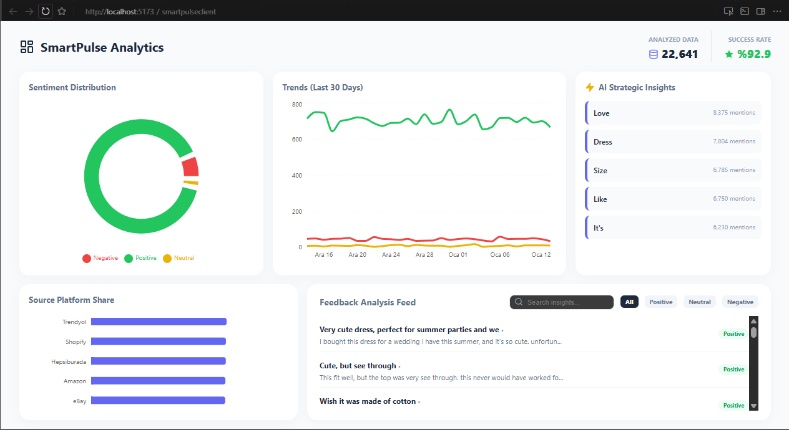

# SmartPulse: Akıllı Müşteri Deneyimi ve Analiz Platformu 🚀

**SmartPulse**, 22.000'den fazla müşteri geri bildirimini yapay zeka ve veri madenciliği yöntemleriyle analiz eden, kurumsal düzeyde bir SaaS (Software as a Service) analiz platformudur.

## 🛠️ Teknik Mimari ve Vizyon
Bu proje, basit bir veri listeleme aracından ziyade, ölçeklenebilir bir **İlişkisel Veritabanı (RDBMS)** mimarisi üzerine inşa edilmiştir:

* **İlişkisel Veri Modeli:** PostgreSQL üzerinde `Companies`, `Sources` ve `Feedbacks` tabloları arasında **Primary Key (PK)** ve **Foreign Key (FK)** ilişkileri kurulmuştur.
* **Big Data Analizi:** 22.641 adet gerçek dünya verisi, .NET 9.0 ve Entity Framework Core kullanılarak yüksek performansla işlenmektedir.
* **Dinamik İçgörüler:** Yapay zeka destekli kelime frekans analizi ile müşteri eğilimleri anlık olarak dashboard'a yansıtılmaktadır.

## 🏗️ Teknoloji Yığını
* **Backend:** .NET 9.0, C#, Entity Framework Core (Code First).
* **Veritabanı:** PostgreSQL (Relational Architecture).
* **Frontend:** React, Tailwind CSS, Recharts, Lucide Icons.
* **Analiz:** Sentiment Analysis Logic & CSV Data Parsing.

## 📊 Dashboard Özellikleri
* **Sentiment Distribution:** Olumlu, olumsuz ve nötr geri bildirimlerin oransal dağılımı.
* **Marketplace Analysis:** Amazon, Trendyol, Shopify gibi farklı kaynaklardan gelen verilerin performans karşılaştırması.
* **Trends (30 Days):** Zaman serisi analizi ile müşteri memnuniyet grafiği.
* **AI Strategic Insights:** En çok konuşulan anahtar kelimelerin (Love, Dress, Size vb.) canlı takibi.